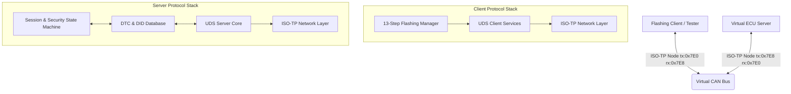

# 基于 Python 的汽车 ECU 虚拟刷写与故障诊断自动化测试系统

本系统是一个采用原生 Python 构建的工业级**汽车电子 ECU 虚拟诊断、刷写 (Bootloader) 与自动化测试仿真系统**。本系统专为汽车电子测试/开发岗位的面试与项目实战设计，重在演示对车载网络通信与诊断协议底层（如 **ISO 15765-2 (ISO-TP)** 和 **ISO 14229 (UDS)**）的深度理解和高质量的工程实现。

---

## 🛠 核心技术架构与协议图

系统遵循 OSI 七层诊断通信模型，分为：
1. **数据链路层 (Link Layer)**：使用 `virtual_bus.py` 在内存中构建虚拟 CAN 总线收发机制，模拟 CAN 2.0 帧的 8 字节填充 (Padding)。
2. **网络/传输层 (Network/Transport Layer)**：由 `iso_tp.py` 从零实现完整的 **ISO-TP (ISO 15765-2)** 协议。支持大数据的分包与组包，包含**单帧 (SF)、首帧 (FF)、流控帧 (FC) 和连续帧 (CF)** 的双向数据交互与时序协商。
3. **应用/诊断层 (Application Layer)**：通过 `uds_server.py` 构建虚拟 ECU，支持 **UDS (ISO 14229)** 状态机跳转（默认、扩展、编程会话）、安全访问 (SecurityAccess)、DID 读写、DTC 故障码管理器（含状态位处理及冻结帧）；`flashing_manager.py` 全自动驱动 **13 步刷写时序**。
4. **测试自动化层 (Automation Testing)**：基于 `pytest` 与 `pytest-html` 建立完整的黑盒与故障注入逆向测试套件。



---

## ✨ 核心亮点功能

### 1. 原生 ISO-TP 协议栈实现 (`iso_tp.py`)
*   **多帧组装与流控协商**：发送长数据时，自动解析接收端流控帧中的 **Block Size (BS)** 和 **Separation Time (STmin)** 参数，分块并按指定毫秒间隔发送连续帧 (CF)，通过 Sequence Number (SN) 进行包序校验。
*   **网络定时约束**：全自动支持 $N\_Bs$ (等待流控超时) 和 $N\_Cr$ (等待连续帧超时) 计时器，一旦超时自动复位接收机并释放总线资源。
*   **防死锁竞态设计**：在发送块边界 Consecutive Frame 前，预先清除流控接收 Event，彻底解决多线程/异步场景下流控帧提前送达导致的死锁问题。

### 2. UDS 诊断状态机与故障管理器 (`uds_server.py`)
*   **会话控制与 S3 定时器**：支持 Default (0x01)、Programming (0x02)、Extended (0x03) 会话切换。如果在非默认会话中 5 秒内无诊断命令且无 TesterPresent (`0x3E`) 维持，ECU 将通过后台守护线程强制退回默认会话并重新锁定安全。
*   **Seed-Key 安全访问服务**：提供动态 32 位种子生成，利用自定义 XOR 加密及加常数算法进行 Key 校验。支持**连续 3 次错密锁定**与 **10 秒安全冷却延时** (`NRC 0x37`)。
*   **DTC 状态字节与冻结帧**：完整支持 **0x19 02**（按状态掩码读取 DTC）与 **0x14**（清除故障码）。DTC 包含多状态字节（如 confirmedDTC, testFailed）和冻结帧快照，真实模拟传感器异常时的故障记忆功能。

### 3. 全自动 13 步 Bootloader 刷写流程 (`flashing_manager.py`)
全自动运行恒润 ZCANPRO 主流刷写规约流程：
1.  进入扩展会话 (`0x10 0x03`)
2.  关闭故障码存储 (`0x85 0x02`)
3.  关闭非诊断报文收发 (`0x28 0x03 0x03`)
4.  切换至编程会话 (`0x10 0x02`)
5.  Seed-Key 安全访问解锁 (`0x27 01 / 02`)
6.  写入刷写指纹信息 (`0x2E F1 5A`)
7.  下载 Flash Driver hex 映像至 RAM 运行 (`0x34 / 0x36 / 0x37`)
8.  执行例程验证 Flash Driver 完整性 (`0x31 01 02 02` 携带 `0x881D` 校验码)
9.  启动例程擦除 Application 区域 Flash (`0x31 01 FF 00`)
10. 下载 APP 固件 hex 映像至 Flash (`0x34 / 0x36 / 0x37`)
11. 执行例程验证 APP 的 CRC-32 校验和 (`0x31 01 02 02` 携带 `0x3378` 校验码)
12. 校验编程依赖性 (`0x31 01 FF 01` 验证整车兼容性)
13. ECU 硬复位并退回默认会话 (`0x11 0x01`)

---

## 🚀 快速运行演示

### 1. ISO-TP 协议层 Trace 交互演示
此 Demo 演示了在虚拟 CAN 总线上，Tester 与 ECU 进行大报文（如下载指纹/多帧交互）时，网络层 FF、FC、CF 和 SF 帧的十六进制 CAN Trace 变化：
```bash
python demo_isotp.py
```

### 2. ECU 诊断服务与 S3 定时器演示
此 Demo 演示了读写 DIDs、注入故障、读取/清除 DTC，以及停止 TesterPresent 5 秒后，ECU 自动退回 Default Session 的过程：
```bash
python demo_ecu.py
```

### 3. 13 步 Bootloader 全自动刷写控制器演示
此 Demo 会在 `scratch/` 目录下根据标准协议格式自动构建 `flash_driver.hex` 和 `app.hex`，并在终端里启动包含 13 个状态的进度条面板（Dashboard）进行自动刷写测试，刷写底层的 CAN 总线 Trace 报文会静默保存到 `can_bus.log` 中：
```bash
python run_flashing.py
```

### 4. 自动化测试套件执行与报告生成
一键运行 positive 刷写和逆向测试用例（包括**非法状态下载、安全密钥错误限制、传输乱序检测**等故障注入场景）：
```bash
python -m pytest tests/ --html=report.html
```
运行完成后，直接双击根目录下的 [report.html](report.html) 查看精美的测试结果图表。

---

## 🎓 经纬恒润/恒润测试岗面试重点（Technical Q&A）

### Q1: 为什么要下载 Flash Driver 到 RAM 中，而不是直接在 App 中固化 Flash 擦写代码？
*   **功能安全限制**：如果将擦写 Flash 的底层驱动代码固化在 Flash 中，万一行车过程中因电磁干扰或软件 Bug 导致单片机程序跑飞，误触了擦写代码，可能会直接把正在运行的 App 擦除，引发重大行车安全事故。
*   **RAM 临时加载**：按照 ISO 26262 规范，擦写驱动只有在刷写时通过 0x34/0x36 动态写入 RAM 并校验。刷写完毕后，ECU 执行 0x11 软硬件复位，RAM 自动清空，擦写代码自然消失，行车安全性得到根本保障。

### Q2: 详细说一下 ISO-TP 协议中各个帧的控制头 (PCI) 是如何定义的？
*   **单帧 (SF)**: 第 1 字节高 4 位为 `0x0`，低 4 位为有效长度 (1-7 字节)。如 `[02 10 03 ...]` 代表长度为 2 的单帧。
*   **首帧 (FF)**: 前 2 字节高 4 位为 `0x1`，剩余 12 位代表整条诊断消息的总长度（最大 4095 字节）。如 `[10 14 62 F1 ...]` 代表总长 20 字节。
*   **流控帧 (FC)**: 第 1 字节高 4 位为 `0x3`，低 4 位为 Flow Status (0=CTS, 1=WT, 2=OVFLW)；第 2 字节为 Block Size (BS)；第 3 字节为 Separation Time (STmin)。
*   **连续帧 (CF)**: 第 1 字节高 4 位为 `0x2`，低 4 位为 Sequence Number (SN, 0x0 - 0xF 循环递增)。

### Q3: 你的 pytest 测试用例是如何设计“逆向注入测试”的？
在 `tests/test_flashing_flow.py` 和 `tests/test_uds_services.py` 中，我设计了丰富的逆向用例：
1.  **安全绕过注入**：直接在 Default/Extended Session 下跳过安全解锁步骤发送 0x34 下载请求，断言 ECU 返回 `NRC 0x33` (Security Access Denied)；
2.  **暴力破解注入**：连续发送 3 次错误密钥，断言触发 `NRC 0x36` (Exceeded Attempts)，并紧接着发送 Seed 请求，断言触发 `NRC 0x37` (Time Delay Not Expired)；
3.  **时序破坏注入**：不发送擦除 Routine 直接下发 APP 下载，断言返回 `NRC 0x24` (Request Sequence Error)；
4.  **数据损坏注入**：在下载 APP 时传输与 hex 大小不符的数据，在 Routine 校验中发送错误 signature 校验码，断言返回 `NRC 0x72` (General Programming Failure)。
